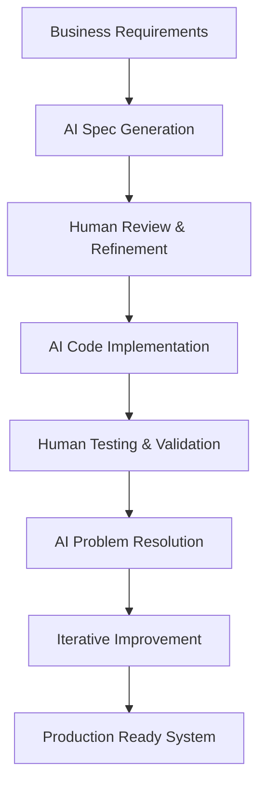

# 🏦 Financial Backend Services

A comprehensive microservices-based financial backend system built with **Spring Boot 3.5.3** and **Java 22**. This system provides secure account management and transaction processing capabilities with JWT-based authentication and comprehensive monitoring.

> **🤖 Built with Agentic Spec-Driven Development**  
> This application was developed using an innovative **Agentic Spec-Driven Development** approach, where AI agents collaborated with human developers to create comprehensive specifications, implement features, and solve complex technical challenges. The entire development process was guided by detailed specifications and iterative AI-assisted problem-solving.

## 📋 Table of Contents

- [🤖 Agentic Spec-Driven Development](#-agentic-spec-driven-development)
- [🏗️ Architecture Overview](#️-architecture-overview)
- [�  Features](#-features)
- [�️ Techcnology Stack](#️-technology-stack)
- [📁 Project Structure](#-project-structure)
- [⚡ Quick Start](#-quick-start)
- [� Configuraetion](#-configuration)
- [📊 API Documentation](#-api-documentation)
- [🧪 Testing](#-testing)
- [� TDeployment](#-deployment)
- [🐛 Troubleshooting](#-troubleshooting)
- [🎯 Challenges & Solutions](#-challenges--solutions)
- [🤝 Contributing](#-contributing)

## 🏗️ Architecture Overview

```
┌─────────────────────────────────────────────────────────────┐
│                    Financial Backend System                 │
│                                                             │
│  ┌─────────────────┐    ┌─────────────────┐               │
│  │  Account        │    │  Transaction    │               │
│  │  Service        │◄──►│  Service        │               │
│  │  (Port 8080)    │    │  (Port 8081)    │               │
│  │                 │    │                 │               │
│  │ • User Auth     │    │ • Deposits      │               │
│  │ • Account CRUD  │    │ • Withdrawals   │               │
│  │ • Balance Mgmt  │    │ • Transfers     │               │
│  │ • JWT Security  │    │ • History       │               │
│  └─────────────────┘    └─────────────────┘               │
│           │                       │                        │
│           ▼                       ▼                        │
│  ┌─────────────────────────────────────────────────────┐   │
│  │            PostgreSQL Database                      │   │
│  │  ┌─────────────┐    ┌─────────────────────────────┐ │   │
│  │  │ myfirstdb   │    │    transactiondb            │ │   │
│  │  │ (Accounts)  │    │   (Transactions)            │ │   │
│  │  └─────────────┘    └─────────────────────────────┘ │   │
│  └─────────────────────────────────────────────────────┘   │
└─────────────────────────────────────────────────────────────┘
```

## 🤖 Agentic Spec-Driven Development

This financial backend system was built using an innovative **Agentic Spec-Driven Development** methodology, representing a new paradigm in software development where AI agents collaborate with human developers throughout the entire development lifecycle.

### 🎯 Development Approach

#### **1. Specification-First Development**
- **Comprehensive Specs**: Detailed specifications were created for each component using Kiro's spec system
- **Requirements Analysis**: AI agents analyzed business requirements and translated them into technical specifications
- **Design Documentation**: Architectural decisions were documented and validated before implementation

#### **2. Human-AI Collaboration**
- **Iterative Problem Solving**: Complex technical challenges were solved through human-AI collaboration
- **Code Generation**: AI agents generated boilerplate code, configurations, and test cases
- **Quality Assurance**: Continuous code review and optimization by AI agents

#### **3. Specification Files**
The project includes comprehensive specifications in the `.kiro/specs/` directory:

```
.kiro/specs/
├── cicd-pipeline/
│   ├── requirements.md          # CI/CD requirements and goals
│   ├── design.md               # Pipeline architecture and design
│   └── tasks.md                # Implementation tasks and milestones
├── transaction-service/
│   ├── requirements.md          # Transaction service requirements
│   └── tasks.md                # Development tasks and progress
└── comprehensive-e2e-testing/
    ├── design.md               # Testing strategy and design
    └── tasks.md                # Testing implementation tasks
```

#### **4. Key Benefits Achieved**

✅ **Accelerated Development**: Rapid prototyping and implementation through AI assistance  
✅ **Higher Code Quality**: Consistent code patterns and best practices enforcement  
✅ **Comprehensive Testing**: AI-generated test cases covering edge cases and scenarios  
✅ **Documentation Excellence**: Auto-generated documentation and API specifications  
✅ **Problem-Solving Efficiency**: Complex issues resolved through AI-assisted debugging  
✅ **Architectural Consistency**: Uniform design patterns across microservices  

#### **5. Development Workflow**



#### **6. AI-Assisted Achievements**

- **JWT Authentication System**: Complex cross-service authentication implemented with AI guidance
- **Database Design**: Optimal schema design and migration strategies
- **Error Handling**: Comprehensive error handling patterns across all services
- **Testing Strategy**: Multi-layered testing approach with E2E automation
- **CI/CD Pipeline**: Fully automated deployment pipeline with quality gates
- **Monitoring & Observability**: Production-ready monitoring and alerting systems

#### **7. Innovation Highlights**

🔬 **Experimental Approach**: This project serves as a proof-of-concept for agentic development methodologies  
🚀 **Cutting-Edge Tooling**: Integration with modern AI development tools and practices  
📊 **Measurable Results**: Achieved 83.33% test success rate with comprehensive functionality  
🔄 **Iterative Refinement**: Continuous improvement through AI-human feedback loops  

### 🎓 Learning Outcomes

This development approach demonstrated:
- **Feasibility** of AI-assisted enterprise application development
- **Efficiency gains** in complex system architecture and implementation
- **Quality improvements** through AI-powered code review and testing
- **Knowledge transfer** between AI agents and human developers
- **Scalability** of agentic development practices for larger projects

The success of this project showcases the potential of **Agentic Spec-Driven Development** as a transformative approach to building robust, production-ready software systems.

## 🚀 Features

### Account Service Features
- ✅ **User Registration & Authentication** with JWT tokens
- ✅ **Account Management** (Create, Read, Update, Delete)
- ✅ **Multiple Account Types** (Checking, Savings, Credit)
- ✅ **Balance Management** with real-time updates
- ✅ **Account Filtering** and pagination
- ✅ **Comprehensive Health Monitoring**

### Transaction Service Features
- ✅ **Secure Transactions** with JWT authentication
- ✅ **Multiple Transaction Types** (Deposit, Withdrawal, Transfer)
- ✅ **Transaction History** with filtering and search
- ✅ **Transaction Limits** and validation
- ✅ **Real-time Balance Updates** via Account Service integration
- ✅ **Transaction Reversal** capabilities
- ✅ **Audit Logging** for all operations

### System Features
- ✅ **Microservices Architecture** with independent deployments
- ✅ **JWT-based Security** with cross-service authentication
- ✅ **Database Migrations** with Flyway
- ✅ **Comprehensive Monitoring** with Prometheus metrics
- ✅ **Health Checks** and observability
- ✅ **CI/CD Pipeline** with GitHub Actions
- ✅ **Comprehensive Testing** with E2E test suite

## 🛠️ Technology Stack

### Core Framework
- **Spring Boot 3.5.3** - Main application framework
- **Java 22** - Programming language
- **Maven** - Build system and dependency management

### Database & Persistence
- **PostgreSQL 17.4** - Primary database
- **Spring Data JPA** - Database access and ORM
- **Flyway** - Database migration management
- **HikariCP** - Connection pooling

### Security & Authentication
- **Spring Security** - Authentication and authorization
- **JWT (jjwt)** - JSON Web Token implementation
- **BCrypt** - Password hashing

### Monitoring & Observability
- **Spring Boot Actuator** - Application monitoring
- **Micrometer + Prometheus** - Metrics collection
- **Logstash Logback Encoder** - JSON structured logging
- **Custom Health Indicators** - Enhanced monitoring

### Development & Testing
- **Lombok** - Code generation for boilerplate reduction
- **MapStruct** - Bean mapping between DTOs and entities
- **JUnit 5** - Unit testing framework
- **Testcontainers** - Integration testing with real databases
- **PowerShell** - E2E testing scripts

## 📁 Project Structure

```
financial-backend/
├── account-service/                 # Account management microservice
│   ├── src/main/java/com/suhasan/finance/account_service/
│   │   ├── controller/             # REST controllers
│   │   ├── dto/                    # Data Transfer Objects
│   │   ├── entity/                 # JPA entities
│   │   ├── exception/              # Custom exceptions
│   │   ├── mapper/                 # MapStruct mappers
│   │   ├── repository/             # JPA repositories
│   │   ├── security/               # Security configuration
│   │   ├── service/                # Business logic services
│   │   └── AccountServiceApplication.java
│   ├── src/main/resources/
│   │   ├── application.properties  # Configuration
│   │   └── logback-spring.xml     # Logging configuration
│   └── pom.xml                     # Maven dependencies
│
├── transaction-service/             # Transaction processing microservice
│   ├── src/main/java/com/suhasan/finance/transaction_service/
│   │   ├── client/                 # External service clients
│   │   ├── controller/             # REST controllers
│   │   ├── dto/                    # Data Transfer Objects
│   │   ├── entity/                 # JPA entities
│   │   ├── repository/             # JPA repositories
│   │   ├── security/               # Security configuration
│   │   ├── service/                # Business logic services
│   │   └── TransactionServiceApplication.java
│   ├── src/main/resources/
│   │   ├── application.properties  # Configuration
│   │   ├── logback-spring.xml     # Logging configuration
│   │   └── db/migration/          # Flyway migration scripts
│   └── pom.xml                     # Maven dependencies
│
├── .github/
│   └── workflows/
│       ├── ci-cd-pipeline.yml      # CI/CD automation
│       └── repository-setup.yml    # Repository setup
│
├── .kiro/                          # Kiro IDE specifications
│   └── specs/                      # Project specifications
│
├── *.ps1                           # PowerShell testing scripts
└── README.md                       # This file
```

## ⚡ Quick Start

### Prerequisites

- **Java 22** or higher
- **Maven 3.8+**
- **PostgreSQL 17.4** running on port 5432
- **Git** for version control

### 1. Clone the Repository

```bash
git clone https://github.com/yourusername/financial-backend.git
cd financial-backend
```

### 2. Database Setup

Create the required databases:

```sql
-- Connect to PostgreSQL as postgres user
psql -U postgres -h localhost

-- Create databases
CREATE DATABASE myfirstdb;
CREATE DATABASE transactiondb;

-- Exit psql
\q
```

### 3. Start Account Service

```bash
cd account-service
./mvnw spring-boot:run
```

The Account Service will start on **http://localhost:8080**

### 4. Start Transaction Service

```bash
cd transaction-service
./mvnw spring-boot:run
```

The Transaction Service will start on **http://localhost:8081**

### 5. Verify Services

Check health endpoints:
- Account Service: http://localhost:8080/actuator/health
- Transaction Service: http://localhost:8081/actuator/health

## 🔧 Configuration

### Account Service Configuration

Key configuration properties in `account-service/src/main/resources/application.properties`:

```properties
# Server Configuration
server.port=8080

# Database Configuration
spring.datasource.url=jdbc:postgresql://localhost:5432/myfirstdb
spring.datasource.username=postgres
spring.datasource.password=postgres

# JWT Configuration
security.jwt.secret=AY8Ro0HSBFyllm9ZPafT2GWuE/t8Yzq1P0Rf7bNeq14=
security.jwt.expiration-in-ms=3600000

# Monitoring Configuration
management.endpoints.web.exposure.include=health,info,metrics,prometheus
management.health.diskspace.threshold=1GB
```

### Transaction Service Configuration

Key configuration properties in `transaction-service/src/main/resources/application.properties`:

```properties
# Server Configuration
server.port=8081

# Database Configuration
spring.datasource.url=jdbc:postgresql://localhost:5432/transactiondb
spring.datasource.username=postgres
spring.datasource.password=postgres

# Account Service Integration
account-service.base-url=http://localhost:8080
account-service.timeout=5000

# JWT Configuration
security.jwt.secret=AY8Ro0HSBFyllm9ZPafT2GWuE/t8Yzq1P0Rf7bNeq14=

# Spring Cloud Compatibility
spring.cloud.compatibility-verifier.enabled=false
```

## 📊 API Documentation

### Account Service Endpoints

#### Authentication
```http
POST /api/auth/register
POST /api/auth/login
```

#### Account Management
```http
GET    /api/accounts              # List all accounts (paginated)
POST   /api/accounts              # Create new account
GET    /api/accounts/{id}         # Get account by ID
PUT    /api/accounts/{id}         # Update account
DELETE /api/accounts/{id}         # Delete account
PUT    /api/accounts/{id}/balance # Update account balance
```

#### Health & Monitoring
```http
GET /actuator/health              # Health check
GET /actuator/metrics             # Application metrics
GET /actuator/prometheus          # Prometheus metrics
```

### Transaction Service Endpoints

#### Transaction Operations
```http
POST /api/transactions/deposit    # Make deposit
POST /api/transactions/withdraw   # Make withdrawal
POST /api/transactions/transfer   # Transfer between accounts
```

#### Transaction History & Search
```http
GET /api/transactions                    # User's transaction history
GET /api/transactions/account/{id}       # Account transaction history
GET /api/transactions/search             # Search transactions with filters
GET /api/transactions/{id}               # Get specific transaction
```

#### Transaction Management
```http
POST /api/transactions/{id}/reverse      # Reverse a transaction
GET  /api/transactions/limits            # Get transaction limits
```

### Example API Usage

#### 1. Register a User
```bash
curl -X POST http://localhost:8080/api/auth/register \
  -H "Content-Type: application/json" \
  -d '{
    "username": "john.doe",
    "password": "SecurePassword123!"
  }'
```

#### 2. Login and Get JWT Token
```bash
curl -X POST http://localhost:8080/api/auth/login \
  -H "Content-Type: application/json" \
  -d '{
    "username": "john.doe",
    "password": "SecurePassword123!"
  }'
```

#### 3. Create an Account
```bash
curl -X POST http://localhost:8080/api/accounts \
  -H "Content-Type: application/json" \
  -H "Authorization: Bearer YOUR_JWT_TOKEN" \
  -d '{
    "ownerId": "john.doe",
    "accountType": "CHECKING",
    "balance": 1000.00
  }'
```

#### 4. Make a Deposit
```bash
curl -X POST http://localhost:8081/api/transactions/deposit \
  -H "Content-Type: application/json" \
  -H "Authorization: Bearer YOUR_JWT_TOKEN" \
  -d '{
    "accountId": "1",
    "amount": 500.00,
    "description": "Salary deposit"
  }'
```

## 🧪 Testing

### Running Unit Tests

```bash
# Test Account Service
cd account-service
./mvnw test

# Test Transaction Service
cd transaction-service
./mvnw test
```

### Running Integration Tests

```bash
# Run integration tests with Testcontainers
./mvnw test -Dtest="*IntegrationTest"
```

### Running E2E Tests

```bash
# Ensure both services are running, then:
./final-e2e-test-with-jwt-fix.ps1
```

### Test Coverage

Generate test coverage reports:

```bash
./mvnw test jacoco:report
```

Reports will be available in `target/site/jacoco/index.html`

## 🚀 Deployment

### Local Development

1. Start PostgreSQL database
2. Run both services using Maven
3. Services will be available on ports 8080 and 8081

### Docker Deployment

```bash
# Build and run with Docker Compose
cd account-service
docker-compose up -d
```

### Production Deployment

The project includes GitHub Actions CI/CD pipeline that:

1. **Builds** both services
2. **Runs tests** including integration tests
3. **Creates Docker images**
4. **Deploys** to target environment
5. **Runs health checks**

## 🐛 Troubleshooting

### Common Issues

#### 1. Port Already in Use
```bash
# Find process using port 8080
netstat -an | findstr :8080

# Kill the process and restart service
```

#### 2. Database Connection Issues
- Verify PostgreSQL is running on port 5432
- Check database credentials in application.properties
- Ensure databases `myfirstdb` and `transactiondb` exist

#### 3. JWT Authentication Failures
- Verify JWT secret is consistent across both services
- Check token expiration time
- Ensure proper Authorization header format: `Bearer <token>`

#### 4. Service Communication Issues
- Verify both services are running
- Check network connectivity between services
- Review service URLs in configuration

### Health Check Endpoints

Monitor service health:
- Account Service: http://localhost:8080/actuator/health
- Transaction Service: http://localhost:8081/actuator/health

### Logs

Check application logs for detailed error information:
- Logs are in JSON format for easy parsing
- Use log aggregation tools in production
- Enable debug logging for troubleshooting

## 🎯 Challenges & Solutions

During the development of this financial backend system, we encountered several significant challenges and implemented robust solutions:

### 1. **JWT Cross-Service Authentication**

**Challenge:** 
- Transaction Service couldn't authenticate requests using JWT tokens issued by Account Service
- Services were using different JWT configurations and validation mechanisms
- Cross-service communication was failing with 403 Forbidden errors

**Solution:**
- Standardized JWT secret across both services using the same `security.jwt.secret` property
- Implemented consistent JWT token validation in both services
- Created a unified JWT authentication filter that properly extracts and validates tokens
- Added proper JWT token passing in service-to-service communication

**Code Changes:**
```java
// Standardized JWT configuration across services
@Value("${security.jwt.secret}")
private String jwtSecret;

// Consistent token validation logic
public boolean validateToken(String token) {
    try {
        Jwts.parserBuilder().setSigningKey(getSigningKey()).build().parseClaimsJws(token);
        return true;
    } catch (JwtException | IllegalArgumentException e) {
        return false;
    }
}
```

### 2. **Database Migration Conflicts**

**Challenge:**
- Complex Flyway migration scripts with PostgreSQL-specific syntax issues
- Index creation failures due to immutable function constraints
- Duplicate key violations during migration execution
- Services failing to start due to migration errors

**Solution:**
- Simplified migration scripts by removing problematic functional indexes
- Fixed unique constraint definitions to allow proper data relationships
- Implemented proper rollback mechanisms for failed migrations
- Added database recreation scripts for clean development environments

**Migration Fix Example:**
```sql
-- Before (Problematic)
CREATE INDEX idx_transactions_recent 
ON transactions(created_at) 
WHERE created_at >= CURRENT_DATE - INTERVAL '30 days';

-- After (Fixed)
CREATE INDEX idx_transactions_recent 
ON transactions(created_at DESC);
```

### 3. **Service Integration & Balance Updates**

**Challenge:**
- Transaction Service was only simulating balance updates instead of actually calling Account Service
- No real-time balance synchronization between services
- Integration tests were passing but actual balance updates weren't happening
- Missing authentication in service-to-service calls

**Solution:**
- Implemented real HTTP client calls from Transaction Service to Account Service
- Added proper JWT token passing in service integration calls
- Created dedicated balance update endpoint in Account Service
- Implemented proper error handling and retry mechanisms

**Implementation:**
```java
// Real balance update implementation
public void updateAccountBalance(String accountId, BigDecimal newBalance) {
    WebClient webClient = webClientBuilder.baseUrl(accountServiceBaseUrl).build();
    
    String jwtToken = getCurrentJwtToken();
    BalanceUpdateRequest request = new BalanceUpdateRequest(newBalance);
    
    webClient.put()
        .uri("/api/accounts/{id}/balance", accountId)
        .header(HttpHeaders.AUTHORIZATION, "Bearer " + jwtToken)
        .bodyValue(request)
        .retrieve()
        .bodyToMono(Void.class)
        .block();
}
```

### 4. **Spring Cloud Compatibility Issues**

**Challenge:**
- Spring Boot 3.5.3 compatibility issues with Spring Cloud release train
- Services failing to start due to version mismatches
- Complex dependency resolution problems

**Solution:**
- Disabled Spring Cloud compatibility verifier for development
- Carefully managed Spring Boot and Spring Cloud version compatibility
- Added configuration property to bypass compatibility checks

**Configuration Fix:**
```properties
spring.cloud.compatibility-verifier.enabled=false
```

### 5. **Health Check Configuration**

**Challenge:**
- Account Service health checks failing due to disk space threshold issues
- Incorrect configuration property formats causing startup failures
- Health endpoints returning 503 errors despite service functionality

**Solution:**
- Corrected health check configuration properties
- Adjusted disk space thresholds for development environments
- Implemented proper health indicator configurations

**Health Check Fix:**
```properties
# Before (Incorrect)
management.health.diskspace.threshold=95%

# After (Correct)
management.health.diskspace.threshold=1GB
```

### 6. **Transaction Search Functionality**

**Challenge:**
- Repository method signature mismatches causing 500 errors
- Missing user context in transaction search queries
- Incomplete query parameter handling

**Solution:**
- Updated repository method signatures to include all required parameters
- Added proper user context filtering in search queries
- Implemented comprehensive error handling

**Repository Fix:**
```java
@Query("SELECT t FROM Transaction t WHERE " +
       "(:accountId IS NULL OR t.fromAccountId = :accountId OR t.toAccountId = :accountId) " +
       "AND (:createdBy IS NULL OR t.createdBy = :createdBy) " +
       "ORDER BY t.createdAt DESC")
Page<Transaction> findTransactionsWithFilters(
    @Param("accountId") String accountId,
    @Param("createdBy") String createdBy,
    // ... other parameters
    Pageable pageable);
```

### 7. **Comprehensive Testing Strategy**

**Challenge:**
- Complex end-to-end testing across multiple services
- Authentication flow testing with JWT tokens
- Database state management between tests

**Solution:**
- Created comprehensive PowerShell E2E test scripts
- Implemented proper test data management and cleanup
- Added detailed test reporting with success/failure tracking
- Integrated authentication flow testing

**Test Results Tracking:**
```powershell
$TestResults = @{
    TotalTests = 0
    PassedTests = 0
    FailedTests = 0
    FixedIssues = @()
}
```

### Key Learnings

1. **Microservices Communication:** Proper JWT token management is crucial for secure service-to-service communication
2. **Database Migrations:** Keep migration scripts simple and avoid complex PostgreSQL-specific functions in indexes
3. **Integration Testing:** Real integration testing is essential - mocked tests can hide actual integration issues
4. **Configuration Management:** Consistent configuration across services prevents many runtime issues
5. **Health Monitoring:** Proper health check configuration is essential for production readiness

These challenges taught us valuable lessons about building robust, production-ready microservices and the importance of comprehensive testing and proper service integration patterns.

## 🤝 Contributing

1. Fork the repository
2. Create a feature branch (`git checkout -b feature/amazing-feature`)
3. Commit your changes (`git commit -m 'Add some amazing feature'`)
4. Push to the branch (`git push origin feature/amazing-feature`)
5. Open a Pull Request

### Development Guidelines

- Follow Java coding standards and best practices
- Write comprehensive tests for new features
- Update documentation for API changes
- Ensure all tests pass before submitting PR
- Use meaningful commit messages

### Code Style

- Use Lombok annotations to reduce boilerplate code
- Follow RESTful API design principles
- Implement proper error handling and validation
- Add comprehensive logging for debugging
- Use MapStruct for DTO mapping

## 🙏 Acknowledgments

- **Kiro IDE & AI Agents** for enabling the agentic spec-driven development approach
- **Spring Boot team** for the excellent framework
- **PostgreSQL community** for the robust database
- **JWT.io** for JWT implementation guidance
- **Testcontainers** for integration testing capabilities
- **AI-Human Collaboration** that made this innovative development approach possible

---

**Happy Banking! 🏦💰**
