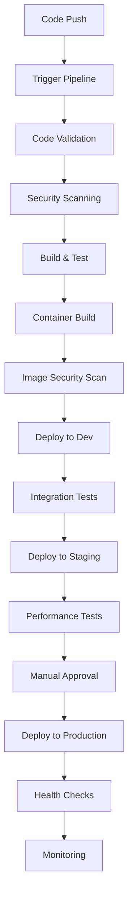

# CI/CD Pipeline Configuration

This directory contains the GitHub Actions workflows and repository configuration for the Account Service CI/CD pipeline.

## Overview

The CI/CD pipeline implements a comprehensive DevSecOps approach with the following key features:

- **Automated Testing**: Unit tests, integration tests, and security scans
- **Multi-Environment Deployment**: Development, staging, and production environments
- **Security-First Approach**: Vulnerability scanning, secret detection, and compliance checks
- **Quality Gates**: Code quality analysis and coverage reporting
- **Infrastructure as Code**: Terraform and Helm for consistent deployments
- **Monitoring Integration**: Prometheus, Grafana, and alerting
- **Notification System**: Slack/Discord integration for pipeline status

## Workflows

### Main Workflows

1. **`ci-cd-pipeline.yml`** - Main CI/CD pipeline
   - Triggers on push to main/develop branches
   - Runs validation, security scans, builds, and deployments
   - Deploys to development environment automatically

2. **`pr-validation.yml`** - Pull request validation
   - Triggers on pull request creation/updates
   - Runs tests and security scans without deployment
   - Provides feedback on PR status

3. **`scheduled-maintenance.yml`** - Scheduled maintenance tasks
   - Runs nightly security scans
   - Checks for dependency updates
   - Cleans up old artifacts

4. **`repository-setup.yml`** - Repository configuration validation
   - Validates branch protection rules
   - Checks security feature configuration
   - Generates setup reports

## Repository Configuration

### Branch Protection
- **Main branch**: Requires PR reviews, status checks, and up-to-date branches
- **Develop branch**: Requires PR validation and security scans
- **Feature branches**: No restrictions, but CI validation runs

### Required Status Checks
- Code validation (compilation, unit tests)
- Security scanning (Trivy, OWASP Dependency Check)
- Code quality analysis
- PR validation for pull requests

### Security Features
- Vulnerability alerts enabled
- Secret scanning enabled
- Push protection for secrets
- CodeQL analysis enabled
- Automated security updates

## Templates

### Issue Templates
- **Bug Report**: Structured bug reporting with security impact assessment
- **Feature Request**: Feature requests with acceptance criteria and technical considerations
- **Security Issue**: Security vulnerability reporting with severity levels

### Pull Request Template
- Comprehensive checklist for code changes
- Security and compliance validation
- Testing requirements
- Documentation updates

## Setup Instructions

### 1. Initial Repository Setup

1. **Enable Security Features**
   ```bash
   # Go to Settings > Security & analysis
   # Enable all recommended security features
   ```

2. **Configure Branch Protection**
   ```bash
   # Go to Settings > Branches
   # Add protection rules for main and develop branches
   ```

3. **Set Up Environments**
   ```bash
   # Go to Settings > Environments
   # Create: development, staging, production
   # Configure protection rules and secrets
   ```

### 2. Required Secrets

#### Repository Secrets
```bash
# Container Registry
GHCR_TOKEN=<github_container_registry_token>

# Monitoring and Notifications
SLACK_WEBHOOK_URL=<slack_webhook_url>
DISCORD_WEBHOOK_URL=<discord_webhook_url>

# Security Tools
SONAR_TOKEN=<sonarcloud_token>
SNYK_TOKEN=<snyk_token>
```

#### Environment Secrets
```bash
# Development
DB_PASSWORD_DEV=<dev_db_password>
JWT_SECRET_DEV=<dev_jwt_secret>

# Staging
DB_PASSWORD_STAGING=<staging_db_password>
JWT_SECRET_STAGING=<staging_jwt_secret>

# Production
DB_PASSWORD_PROD=<prod_db_password>
JWT_SECRET_PROD=<prod_jwt_secret>
```

### 3. Team Configuration

1. **Update CODEOWNERS**
   - Replace placeholder team names with actual GitHub teams
   - Ensure all critical paths have appropriate owners

2. **Configure Team Access**
   - Add team members to appropriate GitHub teams
   - Set up proper permissions for each team

### 4. External Integrations

1. **Slack Integration**
   - Create Slack app and webhook
   - Add webhook URL to repository secrets
   - Configure notification channels

2. **Security Tools**
   - Set up SonarCloud project
   - Configure Snyk integration
   - Enable GitHub Security Advisories

## Pipeline Flow



## Monitoring and Alerts

### Pipeline Metrics
- Build success rate
- Deployment frequency
- Lead time for changes
- Mean time to recovery

### Security Metrics
- Vulnerability scan results
- Secret detection alerts
- Compliance status
- Security incident response time

### Quality Metrics
- Code coverage percentage
- Code quality scores
- Test execution time
- Defect escape rate

## Troubleshooting

### Common Issues

1. **Pipeline Failures**
   - Check workflow logs in Actions tab
   - Verify required secrets are configured
   - Ensure branch protection rules allow the workflow

2. **Security Scan Failures**
   - Review vulnerability reports
   - Update dependencies if needed
   - Configure security tool exceptions if necessary

3. **Deployment Failures**
   - Check environment configuration
   - Verify Kubernetes cluster connectivity
   - Review deployment logs and health checks

### Support

For pipeline issues:
1. Check the Actions tab for detailed logs
2. Review the setup report from repository-setup workflow
3. Contact the DevOps team for infrastructure issues
4. Contact the Security team for security-related issues

## Contributing

When modifying the CI/CD pipeline:

1. Test changes in a feature branch first
2. Update documentation for any new features
3. Ensure backward compatibility
4. Get approval from DevOps and Security teams
5. Monitor pipeline performance after changes

## Compliance

This pipeline configuration supports:
- SOC 2 compliance requirements
- Financial industry security standards
- GDPR data protection requirements
- Audit trail and logging requirements