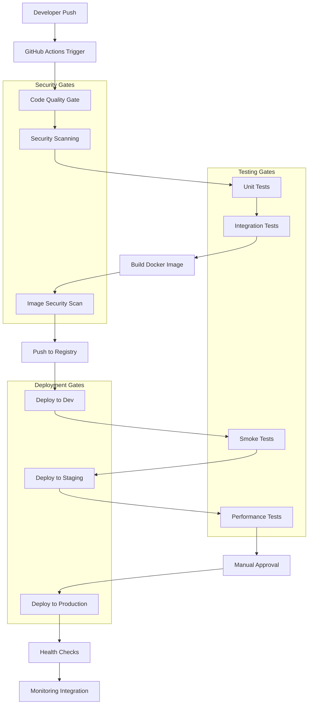

# CI/CD Pipeline Design Document

## Overview

This document outlines the design for a comprehensive CI/CD pipeline for the Account Service financial microservice. The pipeline implements GitOps principles, security-first approach, and production-grade practices suitable for financial services.

## Architecture

### Pipeline Architecture Diagram



### Technology Stack (Free Services Focus)

- **CI/CD Platform**: GitHub Actions (free for public repos, 2000 min/month for private)
- **Container Registry**: Docker Hub (free tier), GitHub Container Registry (free)
- **Kubernetes**: Docker Desktop (local), Minikube (local), Kind (local)
- **Infrastructure as Code**: Terraform (free) + Helm (free)
- **Security Scanning**: 
  - Trivy (free, open source)
  - OWASP Dependency Check (free)
  - GitHub Security Advisories (free)
  - Semgrep (free tier)
- **Code Quality**: 
  - SonarCloud (free for public repos)
  - CodeQL (free on GitHub)
- **Monitoring**: 
  - Prometheus (free, open source)
  - Grafana (free, open source)
  - GitHub Insights (free)
- **Notifications**: 
  - Slack (free tier)
  - Discord (free)
  - Email notifications (free)
- **Secrets Management**: 
  - GitHub Secrets (free)
  - Kubernetes Secrets (free)
- **Testing**: 
  - JUnit (free)
  - TestContainers (free)
  - K6 (free, open source)

## Components and Interfaces

### 1. Source Code Management Integration

**Component**: GitHub Actions Workflows
- **Triggers**: Push to main, PR creation, tag creation
- **Branches Strategy**: GitFlow with main, develop, feature branches
- **Webhook Integration**: Automatic pipeline triggering

**Interface**:
```yaml
on:
  push:
    branches: [main, develop]
  pull_request:
    branches: [main]
  release:
    types: [published]
```

### 2. Code Quality and Security Gates

**Component**: Multi-stage validation pipeline
- **Static Analysis**: SonarQube integration
- **Security Scanning**: Multiple tools (Trivy, Snyk, Semgrep)
- **Dependency Checking**: OWASP Dependency Check
- **Secret Detection**: GitLeaks, TruffleHog

**Interface**:
```yaml
jobs:
  security-scan:
    runs-on: ubuntu-latest
    steps:
      - name: Code Security Scan
      - name: Dependency Vulnerability Scan
      - name: Secret Detection
      - name: Code Quality Analysis
```

### 3. Testing Framework

**Component**: Comprehensive testing suite
- **Unit Tests**: JUnit with Mockito
- **Integration Tests**: TestContainers with PostgreSQL
- **Contract Tests**: Pact for API contracts
- **Performance Tests**: JMeter / K6
- **Security Tests**: OWASP ZAP

**Interface**:
```yaml
test-matrix:
  strategy:
    matrix:
      test-type: [unit, integration, contract, security]
      java-version: [22]
```

### 4. Container Image Management

**Component**: Docker image lifecycle management
- **Multi-stage Builds**: Optimized for security and size
- **Image Scanning**: Trivy for vulnerability assessment
- **Registry Management**: Automated tagging and cleanup
- **Image Signing**: Cosign for supply chain security

**Interface**:
```yaml
build-and-scan:
  steps:
    - name: Build Docker Image
    - name: Scan Image for Vulnerabilities
    - name: Sign Image
    - name: Push to Registry
```

### 5. Environment Management

**Component**: Multi-environment deployment strategy
- **Development**: Automatic deployment on main branch
- **Staging**: Automatic deployment with approval gates
- **Production**: Manual approval with rollback capability
- **Feature Environments**: Dynamic environments for feature branches

**Environments**:
```yaml
environments:
  development:
    auto-deploy: true
    approval: false
  staging:
    auto-deploy: true
    approval: required
  production:
    auto-deploy: false
    approval: required
    protection-rules: enabled
```

### 6. Infrastructure as Code

**Component**: Terraform + Helm deployment
- **Terraform**: Infrastructure provisioning
- **Helm**: Application deployment and configuration
- **GitOps**: ArgoCD for continuous deployment
- **State Management**: Remote state with locking

**Structure**:
```
infrastructure/
├── terraform/
│   ├── environments/
│   │   ├── dev/
│   │   ├── staging/
│   │   └── prod/
│   └── modules/
└── helm/
    ├── account-service/
    └── shared-services/
```

## Data Models

### Pipeline Configuration Model

```yaml
pipeline:
  name: account-service-cicd
  triggers:
    - push: [main, develop]
    - pull_request: [main]
    - schedule: "0 2 * * *"  # Nightly builds
  
  stages:
    - name: validate
      parallel: true
      jobs: [lint, security-scan, unit-tests]
    
    - name: build
      depends_on: [validate]
      jobs: [docker-build, image-scan]
    
    - name: deploy-dev
      depends_on: [build]
      environment: development
      auto_deploy: true
    
    - name: test-integration
      depends_on: [deploy-dev]
      jobs: [integration-tests, smoke-tests]
    
    - name: deploy-staging
      depends_on: [test-integration]
      environment: staging
      approval_required: true
    
    - name: test-performance
      depends_on: [deploy-staging]
      jobs: [load-tests, security-tests]
    
    - name: deploy-production
      depends_on: [test-performance]
      environment: production
      approval_required: true
      rollback_enabled: true
```

### Deployment Configuration Model

```yaml
deployment:
  strategy: rolling-update
  replicas:
    min: 3
    max: 10
  health_checks:
    liveness: /actuator/health/liveness
    readiness: /actuator/health/readiness
    startup: /actuator/health
  
  rollback:
    enabled: true
    automatic_triggers:
      - health_check_failure
      - error_rate_threshold: 5%
      - response_time_threshold: 2s
  
  monitoring:
    metrics_endpoint: /actuator/prometheus
    alerts:
      - high_error_rate
      - high_response_time
      - low_availability
```

## Error Handling

### Pipeline Failure Scenarios

1. **Build Failures**
   - Compilation errors → Immediate notification to developer
   - Test failures → Detailed test report with failure analysis
   - Security scan failures → Block deployment, create security ticket

2. **Deployment Failures**
   - Infrastructure failures → Automatic retry with exponential backoff
   - Application startup failures → Automatic rollback to previous version
   - Health check failures → Circuit breaker pattern, alert operations team

3. **Security Violations**
   - Critical vulnerabilities → Immediate pipeline halt, security team notification
   - License compliance issues → Legal team notification, deployment block
   - Secret exposure → Immediate secret rotation, security incident creation

### Error Recovery Strategies

```yaml
error_handling:
  retry_policy:
    max_attempts: 3
    backoff_strategy: exponential
    retry_conditions:
      - network_timeout
      - temporary_infrastructure_failure
  
  rollback_policy:
    automatic_triggers:
      - deployment_failure
      - health_check_failure
      - performance_degradation
    
    manual_triggers:
      - security_incident
      - business_decision
  
  notification_policy:
    immediate:
      - security_violations
      - production_failures
    
    daily_summary:
      - build_statistics
      - deployment_metrics
```

## Testing Strategy

### Test Pyramid Implementation

1. **Unit Tests (70%)**
   - Fast execution (< 30 seconds total)
   - High code coverage (> 80%)
   - Mocked external dependencies
   - Parallel execution

2. **Integration Tests (20%)**
   - TestContainers for database testing
   - Real external service integration
   - End-to-end API testing
   - Contract testing with Pact

3. **End-to-End Tests (10%)**
   - Full system testing
   - User journey validation
   - Performance baseline testing
   - Security penetration testing

### Testing Environments

```yaml
test_environments:
  unit:
    type: in-memory
    duration: fast
    isolation: complete
  
  integration:
    type: containerized
    services: [postgres, redis]
    duration: medium
    isolation: per-test-suite
  
  e2e:
    type: kubernetes
    services: [full-stack]
    duration: slow
    isolation: per-test-run
```

### Performance Testing Strategy

```yaml
performance_tests:
  load_testing:
    tool: k6
    scenarios:
      - name: normal_load
        users: 100
        duration: 5m
      
      - name: stress_test
        users: 500
        duration: 2m
      
      - name: spike_test
        users: 1000
        duration: 30s
  
  thresholds:
    response_time_p95: 500ms
    error_rate: 1%
    throughput_min: 1000rps
```

## Security Implementation

### Security Scanning Pipeline

```yaml
security_pipeline:
  static_analysis:
    tools: [sonarqube, semgrep, bandit]
    fail_on: [high, critical]
  
  dependency_scanning:
    tools: [snyk, owasp-dependency-check]
    auto_fix: true
    fail_on: [high, critical]
  
  container_scanning:
    tools: [trivy, clair]
    base_image_scanning: true
    fail_on: [high, critical]
  
  runtime_security:
    tools: [falco, twistlock]
    monitoring: continuous
    alerts: immediate
```

### Secrets Management

```yaml
secrets_management:
  detection:
    tools: [gitleaks, truffleHog]
    pre_commit_hooks: true
    
  storage:
    kubernetes_secrets: development
    vault: production
    rotation_policy: 90_days
  
  access_control:
    rbac: enabled
    audit_logging: enabled
    least_privilege: enforced
```

## Monitoring and Observability

### Pipeline Metrics

```yaml
pipeline_metrics:
  build_metrics:
    - build_duration
    - build_success_rate
    - test_coverage
    - security_scan_results
  
  deployment_metrics:
    - deployment_frequency
    - lead_time
    - mean_time_to_recovery
    - change_failure_rate
  
  business_metrics:
    - feature_delivery_time
    - defect_escape_rate
    - customer_satisfaction
    - system_availability
```

### Alerting Strategy

```yaml
alerting:
  critical:
    - production_deployment_failure
    - security_vulnerability_critical
    - system_down
    
  warning:
    - test_failure_rate_high
    - build_duration_increased
    - performance_degradation
  
  info:
    - successful_deployment
    - new_feature_released
    - scheduled_maintenance
```

## Deployment Strategies

### Blue-Green Deployment

```yaml
blue_green_deployment:
  strategy: blue-green
  traffic_routing: istio
  validation_period: 10m
  rollback_trigger: automatic
  
  phases:
    1. deploy_green_environment
    2. run_smoke_tests
    3. switch_traffic_gradually
    4. monitor_metrics
    5. complete_switch_or_rollback
```

### Canary Deployment

```yaml
canary_deployment:
  strategy: canary
  traffic_split: [90, 10]  # old, new
  success_criteria:
    error_rate: < 1%
    response_time: < 500ms
    
  phases:
    - traffic: 10%
      duration: 5m
    - traffic: 25%
      duration: 10m
    - traffic: 50%
      duration: 15m
    - traffic: 100%
      duration: complete
```

This design provides a comprehensive, production-ready CI/CD pipeline that addresses all the requirements while maintaining security, reliability, and scalability for a financial microservice.