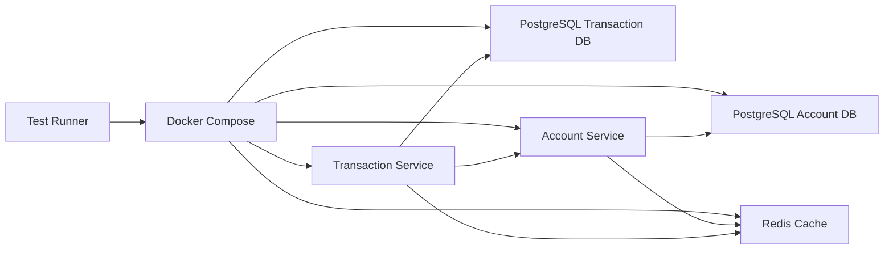
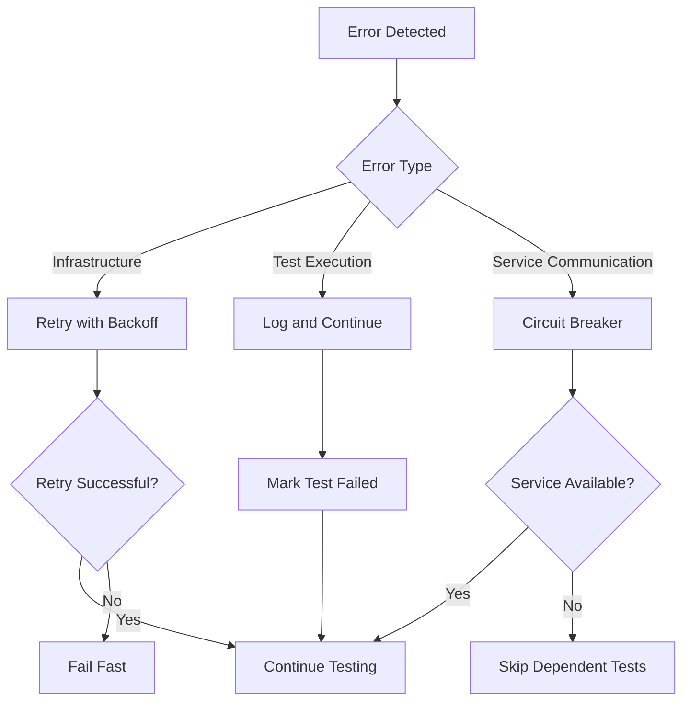

# Comprehensive E2E Testing Design

## Overview

The comprehensive E2E testing solution will be implemented as a multi-layered testing framework that validates the entire financial backend system. The design follows a modular approach with separate test suites for infrastructure, individual services, integration, and end-to-end workflows.

## Architecture

### High-Level Architecture

```mermaid
graph TB
    A[E2E Test Runner] --> B[Infrastructure Tests]
    A --> C[Service Tests]
    A --> D[Integration Tests]
    A --> E[Workflow Tests]
    A --> F[Performance Tests]
    A --> G[Security Tests]
    
    B --> H[Database Validation]
    B --> I[Service Health Checks]
    B --> J[Container Orchestration]
    
    C --> K[Account Service Tests]
    C --> L[Transaction Service Tests]
    
    D --> M[Service-to-Service Communication]
    D --> N[JWT Token Validation]
    D --> O[Data Consistency Checks]
    
    E --> P[User Registration Flow]
    E --> Q[Transaction Workflows]
    E --> R[Error Scenario Testing]
    
    F --> S[Load Testing]
    F --> T[Performance Metrics]
    
    G --> U[Authentication Tests]
    G --> V[Authorization Tests]
    G --> W[Input Validation Tests]
```



### Test Environment Architecture



## Components and Interfaces

### 1. Test Runner Framework

**Purpose:** Central orchestrator for all E2E tests

**Key Components:**
- `E2ETestRunner`: Main test execution engine
- `TestConfiguration`: Configuration management
- `TestReporter`: Results collection and reporting
- `ServiceOrchestrator`: Docker Compose management

**Interfaces:**
```typescript
interface TestRunner {
    runAllTests(): Promise<TestResults>
    runTestSuite(suite: TestSuite): Promise<SuiteResults>
    generateReport(): TestReport
}

interface TestConfiguration {
    serviceUrls: ServiceUrls
    timeouts: TimeoutConfig
    testData: TestDataConfig
    reporting: ReportingConfig
}
```

### 2. Infrastructure Test Suite

**Purpose:** Validates system infrastructure and service startup

**Key Components:**
- `DatabaseValidator`: PostgreSQL connection and schema validation
- `CacheValidator`: Redis connectivity and functionality
- `ServiceHealthChecker`: Health endpoint validation
- `ContainerManager`: Docker container lifecycle management

**Test Categories:**
- Database connectivity and schema validation
- Redis cache functionality
- Service startup and health checks
- Container orchestration validation

### 3. Account Service Test Suite

**Purpose:** Comprehensive testing of Account Service endpoints

**Key Components:**
- `AuthenticationTester`: Login/registration endpoint testing
- `AccountManagementTester`: CRUD operations testing
- `AccountFilterTester`: Search and filtering testing
- `ErrorScenarioTester`: Error handling validation

**Endpoint Coverage:**
- `POST /api/auth/register` - User registration
- `POST /api/auth/login` - User authentication
- `GET /api/accounts` - Account listing with pagination/filtering
- `POST /api/accounts` - Account creation
- `GET /api/accounts/{id}` - Account retrieval
- `PUT /api/accounts/{id}` - Account updates
- `DELETE /api/accounts/{id}` - Account deletion
- `PUT /api/accounts/{id}/balance` - Balance updates

### 4. Transaction Service Test Suite

**Purpose:** Comprehensive testing of Transaction Service endpoints

**Key Components:**
- `TransactionProcessorTester`: Transaction creation testing
- `TransactionQueryTester`: Transaction retrieval testing
- `TransactionFilterTester`: Search and filtering testing
- `TransactionStatsTester`: Statistics endpoint testing
- `TransactionReversalTester`: Reversal functionality testing

**Endpoint Coverage:**
- `POST /api/transactions/deposit` - Deposit processing
- `POST /api/transactions/withdraw` - Withdrawal processing
- `POST /api/transactions/transfer` - Transfer processing
- `GET /api/transactions/{id}` - Transaction retrieval
- `GET /api/transactions` - User transaction history
- `GET /api/transactions/account/{id}` - Account transaction history
- `GET /api/transactions/search` - Transaction search with filters
- `GET /api/transactions/user/stats` - User transaction statistics
- `POST /api/transactions/{id}/reverse` - Transaction reversal
- `GET /api/transactions/limits` - Transaction limits

### 5. Integration Test Suite

**Purpose:** Tests service-to-service communication and data consistency

**Key Components:**
- `ServiceCommunicationTester`: Inter-service API calls
- `JWTIntegrationTester`: Token validation across services
- `DataConsistencyTester`: Cross-service data validation
- `ErrorPropagationTester`: Error handling across services

**Integration Scenarios:**
- Account validation during transaction processing
- Balance updates via service-to-service calls
- JWT token validation consistency
- Error handling and rollback mechanisms

### 6. End-to-End Workflow Test Suite

**Purpose:** Tests complete user journeys and business workflows

**Key Components:**
- `UserJourneyTester`: Complete user lifecycle testing
- `TransactionWorkflowTester`: Financial transaction workflows
- `ConcurrencyTester`: Concurrent operation testing
- `ErrorRecoveryTester`: Error scenario and recovery testing

**Workflow Scenarios:**
- Complete user onboarding (register → login → create account)
- Deposit workflow (authenticate → validate account → process deposit → verify balance)
- Withdrawal workflow (authenticate → validate funds → process withdrawal → verify balance)
- Transfer workflow (authenticate → validate accounts → process transfer → verify balances)
- Transaction history validation
- Concurrent transaction processing

### 7. Performance Test Suite

**Purpose:** Validates system performance under various load conditions

**Key Components:**
- `LoadGenerator`: Concurrent request generation
- `PerformanceMonitor`: Response time and throughput measurement
- `ResourceMonitor`: System resource utilization tracking
- `BottleneckAnalyzer`: Performance bottleneck identification

**Performance Scenarios:**
- Concurrent user registration and authentication
- Concurrent account creation and management
- Concurrent transaction processing
- Database connection pool testing
- Cache performance validation

### 8. Security Test Suite

**Purpose:** Validates security controls and data protection

**Key Components:**
- `AuthenticationTester`: Authentication mechanism validation
- `AuthorizationTester`: Access control validation
- `InputValidationTester`: Input sanitization testing
- `SecurityHeaderTester`: Security header validation

**Security Scenarios:**
- Unauthenticated access attempts
- Cross-user data access attempts
- JWT token manipulation and validation
- SQL injection and XSS prevention
- Password security validation

## Data Models

### Test Configuration Model

```json
{
  "services": {
    "accountService": {
      "url": "http://localhost:8081",
      "healthEndpoint": "/actuator/health",
      "startupTimeout": 180
    },
    "transactionService": {
      "url": "http://localhost:8080",
      "healthEndpoint": "/actuator/health",
      "startupTimeout": 180
    }
  },
  "databases": {
    "accountDb": {
      "host": "localhost",
      "port": 5432,
      "database": "account_db",
      "username": "postgres",
      "password": "postgres"
    },
    "transactionDb": {
      "host": "localhost",
      "port": 5433,
      "database": "transaction_db",
      "username": "postgres",
      "password": "postgres"
    }
  },
  "testData": {
    "users": [
      {
        "username": "testuser1",
        "password": "password123",
        "accounts": [
          {
            "accountType": "CHECKING",
            "initialBalance": 1000.00
          }
        ]
      }
    ]
  },
  "performance": {
    "concurrentUsers": 10,
    "testDuration": 300,
    "rampUpTime": 60
  }
}
```

### Test Results Model

```json
{
  "testRun": {
    "id": "test-run-2024-01-15-10-30-00",
    "startTime": "2024-01-15T10:30:00Z",
    "endTime": "2024-01-15T10:45:00Z",
    "duration": 900,
    "status": "PASSED"
  },
  "suites": [
    {
      "name": "Infrastructure Tests",
      "status": "PASSED",
      "tests": [
        {
          "name": "Database Connectivity",
          "status": "PASSED",
          "duration": 2.5,
          "details": "All database connections successful"
        }
      ]
    }
  ],
  "metrics": {
    "totalTests": 150,
    "passed": 148,
    "failed": 2,
    "skipped": 0,
    "coverage": {
      "endpoints": 95.5,
      "workflows": 100.0
    },
    "performance": {
      "averageResponseTime": 125.5,
      "p95ResponseTime": 250.0,
      "throughput": 45.2
    }
  }
}
```

## Error Handling

### Error Categories

1. **Infrastructure Errors**
   - Database connection failures
   - Service startup failures
   - Container orchestration issues

2. **Test Execution Errors**
   - Test timeout errors
   - Assertion failures
   - Data setup/teardown errors

3. **Service Communication Errors**
   - HTTP request failures
   - Authentication errors
   - Service unavailability

### Error Handling Strategy



### Retry Mechanisms

- **Database Connections**: Exponential backoff with max 5 retries
- **Service Health Checks**: Linear backoff with max 10 retries
- **HTTP Requests**: Exponential backoff with max 3 retries
- **Container Startup**: Linear backoff with max 20 retries

## Testing Strategy

### Test Execution Flow

1. **Pre-Test Setup**
   - Clean environment preparation
   - Docker Compose service startup
   - Database schema validation
   - Test data preparation

2. **Test Execution Phases**
   - Infrastructure validation
   - Individual service testing
   - Integration testing
   - End-to-end workflow testing
   - Performance testing
   - Security testing

3. **Post-Test Cleanup**
   - Test data cleanup
   - Service shutdown
   - Container cleanup
   - Report generation

### Test Data Management

- **Test Data Isolation**: Each test suite uses isolated test data
- **Data Cleanup**: Automatic cleanup after each test suite
- **Data Seeding**: Consistent test data setup for reproducible results
- **Data Validation**: Pre and post-test data integrity checks

### Parallel Execution Strategy

- **Suite-Level Parallelism**: Different test suites run in parallel
- **Test-Level Isolation**: Individual tests within suites run sequentially
- **Resource Management**: Shared resources (databases, services) are properly managed
- **Result Aggregation**: Parallel test results are properly aggregated

## Implementation Technologies

### Core Technologies

- **Test Framework**: Jest/Mocha with TypeScript for test execution
- **HTTP Client**: Axios for API testing with retry and timeout configuration
- **Container Orchestration**: Docker Compose for service management
- **Database Testing**: pg (PostgreSQL client) for database validation
- **Cache Testing**: redis client for Redis validation
- **Load Testing**: Artillery.js for performance testing
- **Reporting**: Custom HTML/JSON report generation

### Supporting Tools

- **Configuration Management**: dotenv for environment configuration
- **Logging**: Winston for structured logging
- **Metrics Collection**: Custom metrics collection and analysis
- **CI/CD Integration**: GitHub Actions integration for automated testing
- **Documentation**: Automated test documentation generation

## Deployment and Execution

### Local Development

```bash
# Setup and run E2E tests locally
npm install
npm run e2e:setup
npm run e2e:test
npm run e2e:report
```

### CI/CD Pipeline Integration

```yaml
# GitHub Actions workflow
- name: Run E2E Tests
  run: |
    docker-compose -f docker-compose-e2e.yml up -d
    npm run e2e:wait-for-services
    npm run e2e:test
    npm run e2e:report
  env:
    E2E_TIMEOUT: 300
    E2E_PARALLEL: true
```

### Test Environment Configuration

- **Development**: Local Docker Compose with test databases
- **CI/CD**: Containerized environment with isolated test data
- **Staging**: Full environment testing with production-like data
- **Production**: Smoke tests only with minimal test data

This design provides a comprehensive, scalable, and maintainable E2E testing solution that covers all aspects of the financial backend system while ensuring reliability and performance.