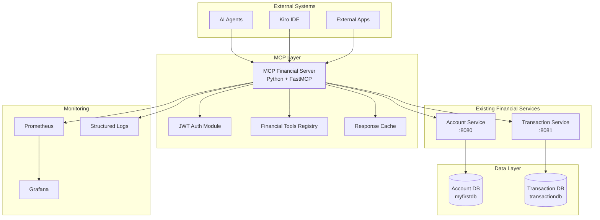

# Design Document

## Overview

The MCP Financial Integration system will implement a Model Context Protocol (MCP) server that provides AI agents and external systems with secure, controlled access to the existing financial backend services. The design leverages a microservices-compatible architecture that integrates seamlessly with the current Spring Boot-based financial services ecosystem.

The MCP server will be implemented as a standalone Python application using the official MCP SDK, providing a language-agnostic interface that can communicate with the Java-based financial services through REST APIs. This approach maintains clear separation of concerns while enabling powerful AI-driven financial operations.

## Architecture

### High-Level Architecture



### MCP Server Architecture

The MCP server will be structured as a modular Python application with the following components:

```
mcp-financial-server/
├── src/
│   ├── mcp_financial/
│   │   ├── __init__.py
│   │   ├── server.py              # Main MCP server implementation
│   │   ├── auth/
│   │   │   ├── __init__.py
│   │   │   ├── jwt_handler.py     # JWT authentication
│   │   │   └── permissions.py     # Role-based access control
│   │   ├── clients/
│   │   │   ├── __init__.py
│   │   │   ├── account_client.py  # Account Service HTTP client
│   │   │   ├── transaction_client.py # Transaction Service HTTP client
│   │   │   └── base_client.py     # Base HTTP client with retry/circuit breaker
│   │   ├── tools/
│   │   │   ├── __init__.py
│   │   │   ├── account_tools.py   # Account management MCP tools
│   │   │   ├── transaction_tools.py # Transaction MCP tools
│   │   │   ├── query_tools.py     # Data query MCP tools
│   │   │   └── monitoring_tools.py # Health/monitoring MCP tools
│   │   ├── models/
│   │   │   ├── __init__.py
│   │   │   ├── requests.py        # Request/response models
│   │   │   └── responses.py       # Structured response models
│   │   ├── utils/
│   │   │   ├── __init__.py
│   │   │   ├── logging.py         # Structured logging
│   │   │   ├── metrics.py         # Prometheus metrics
│   │   │   └── validation.py      # Input validation
│   │   └── config/
│   │       ├── __init__.py
│   │       └── settings.py        # Configuration management
│   └── main.py                    # Application entry point
├── tests/
│   ├── unit/
│   ├── integration/
│   └── e2e/
├── requirements.txt
├── pyproject.toml
├── Dockerfile
├── docker-compose.yml
└── README.md
```

## Components and Interfaces

### 1. MCP Server Core (`server.py`)

The main MCP server implementation using the FastMCP framework:

```python
from mcp.server.fastmcp import FastMCP
from mcp.server.models import InitializationOptions
from mcp.types import Tool, TextContent

class FinancialMCPServer:
    def __init__(self):
        self.app = FastMCP("Financial Services MCP")
        self.account_client = AccountServiceClient()
        self.transaction_client = TransactionServiceClient()
        self.auth_handler = JWTAuthHandler()
        
    async def initialize(self, options: InitializationOptions):
        # Server initialization logic
        await self._register_tools()
        await self._setup_monitoring()
        
    async def _register_tools(self):
        # Register all financial tools
        self._register_account_tools()
        self._register_transaction_tools()
        self._register_query_tools()
```

### 2. Authentication Module (`auth/jwt_handler.py`)

JWT authentication compatible with existing services:

```python
import jwt
from datetime import datetime, timedelta
from typing import Optional, Dict, Any

class JWTAuthHandler:
    def __init__(self, secret_key: str):
        self.secret_key = secret_key
        
    def validate_token(self, token: str) -> Optional[Dict[str, Any]]:
        """Validate JWT token and return user claims"""
        try:
            payload = jwt.decode(token, self.secret_key, algorithms=['HS256'])
            return payload
        except jwt.ExpiredSignatureError:
            raise AuthenticationError("Token has expired")
        except jwt.InvalidTokenError:
            raise AuthenticationError("Invalid token")
            
    def extract_user_context(self, token: str) -> UserContext:
        """Extract user context for authorization"""
        claims = self.validate_token(token)
        return UserContext(
            user_id=claims.get('sub'),
            username=claims.get('username'),
            roles=claims.get('roles', [])
        )
```

### 3. Service Clients (`clients/`)

HTTP clients for backend service integration:

```python
import httpx
from tenacity import retry, stop_after_attempt, wait_exponential
from circuit_breaker import CircuitBreaker

class AccountServiceClient:
    def __init__(self, base_url: str, timeout: int = 5000):
        self.base_url = base_url
        self.client = httpx.AsyncClient(timeout=timeout/1000)
        self.circuit_breaker = CircuitBreaker(failure_threshold=5)
        
    @retry(stop=stop_after_attempt(3), wait=wait_exponential(multiplier=1, min=1, max=10))
    @circuit_breaker
    async def get_account(self, account_id: str, auth_token: str) -> Dict[str, Any]:
        """Get account details"""
        headers = {"Authorization": f"Bearer {auth_token}"}
        response = await self.client.get(
            f"{self.base_url}/api/accounts/{account_id}",
            headers=headers
        )
        response.raise_for_status()
        return response.json()
        
    async def create_account(self, account_data: Dict[str, Any], auth_token: str) -> Dict[str, Any]:
        """Create new account"""
        headers = {"Authorization": f"Bearer {auth_token}"}
        response = await self.client.post(
            f"{self.base_url}/api/accounts",
            json=account_data,
            headers=headers
        )
        response.raise_for_status()
        return response.json()
```

### 4. MCP Tools Implementation (`tools/`)

Financial operation tools exposed through MCP:

```python
from mcp.types import Tool, TextContent
from mcp.server.fastmcp import FastMCP

class AccountTools:
    def __init__(self, app: FastMCP, account_client: AccountServiceClient):
        self.app = app
        self.account_client = account_client
        self._register_tools()
        
    def _register_tools(self):
        @self.app.tool()
        async def create_account(
            owner_id: str,
            account_type: str,
            initial_balance: float = 0.0,
            auth_token: str = None
        ) -> list[TextContent]:
            """Create a new financial account"""
            try:
                # Validate authentication
                user_context = self.auth_handler.extract_user_context(auth_token)
                
                # Validate permissions
                if not self.permissions.can_create_account(user_context, owner_id):
                    raise PermissionError("Insufficient permissions to create account")
                
                # Create account through service
                account_data = {
                    "ownerId": owner_id,
                    "accountType": account_type,
                    "balance": initial_balance
                }
                
                result = await self.account_client.create_account(account_data, auth_token)
                
                return [TextContent(
                    type="text",
                    text=f"Account created successfully: {result['id']}"
                )]
                
            except Exception as e:
                return [TextContent(
                    type="text", 
                    text=f"Error creating account: {str(e)}"
                )]
```

### 5. Data Models (`models/`)

Structured request/response models:

```python
from pydantic import BaseModel, Field
from typing import Optional, List
from decimal import Decimal
from datetime import datetime

class AccountRequest(BaseModel):
    owner_id: str = Field(..., description="Account owner identifier")
    account_type: str = Field(..., description="Type of account (CHECKING, SAVINGS, CREDIT)")
    initial_balance: Decimal = Field(default=0.0, description="Initial account balance")

class TransactionRequest(BaseModel):
    account_id: str = Field(..., description="Account identifier")
    amount: Decimal = Field(..., description="Transaction amount")
    description: Optional[str] = Field(None, description="Transaction description")
    transaction_type: str = Field(..., description="Transaction type (DEPOSIT, WITHDRAWAL, TRANSFER)")

class TransactionResponse(BaseModel):
    transaction_id: str
    account_id: str
    amount: Decimal
    transaction_type: str
    status: str
    created_at: datetime
    description: Optional[str]
```

## Data Models

### MCP Tool Definitions

The MCP server will expose the following tools with their parameter schemas:

#### Account Management Tools
- `create_account`: Create new financial account
- `get_account`: Retrieve account details
- `update_account`: Modify account information
- `delete_account`: Close account
- `get_account_balance`: Get current balance
- `update_account_balance`: Modify account balance

#### Transaction Tools
- `deposit_funds`: Make deposit to account
- `withdraw_funds`: Withdraw from account
- `transfer_funds`: Transfer between accounts
- `get_transaction`: Get transaction details
- `reverse_transaction`: Reverse a transaction

#### Query Tools
- `get_transaction_history`: Get paginated transaction history
- `search_transactions`: Search transactions with filters
- `get_account_analytics`: Get account analytics and metrics
- `get_transaction_limits`: Get current transaction limits

#### Monitoring Tools
- `health_check`: Check system health
- `get_metrics`: Get performance metrics
- `get_service_status`: Get backend service status

### Authentication Context

```python
class UserContext:
    user_id: str
    username: str
    roles: List[str]
    permissions: List[str]
    
class AuthenticationContext:
    user: UserContext
    token: str
    expires_at: datetime
    issued_at: datetime
```

## Error Handling

### Error Response Structure

All MCP tools will return structured error responses:

```python
class MCPErrorResponse:
    error_code: str
    error_message: str
    details: Optional[Dict[str, Any]]
    timestamp: datetime
    request_id: str
```

### Error Categories

1. **Authentication Errors** (AUTH_*)
   - AUTH_INVALID_TOKEN: Invalid or expired JWT token
   - AUTH_INSUFFICIENT_PERMISSIONS: User lacks required permissions
   - AUTH_RATE_LIMITED: Too many requests from client

2. **Validation Errors** (VALIDATION_*)
   - VALIDATION_INVALID_PARAMETERS: Invalid tool parameters
   - VALIDATION_MISSING_REQUIRED: Missing required parameters
   - VALIDATION_BUSINESS_RULE: Business rule validation failure

3. **Service Errors** (SERVICE_*)
   - SERVICE_UNAVAILABLE: Backend service unavailable
   - SERVICE_TIMEOUT: Service request timeout
   - SERVICE_CIRCUIT_BREAKER: Circuit breaker activated

4. **Data Errors** (DATA_*)
   - DATA_NOT_FOUND: Requested resource not found
   - DATA_CONFLICT: Data conflict (e.g., insufficient funds)
   - DATA_INTEGRITY: Data integrity violation

### Circuit Breaker Implementation

```python
class CircuitBreakerConfig:
    failure_threshold: int = 5
    recovery_timeout: int = 30
    expected_exception: Type[Exception] = httpx.HTTPError
    
class ServiceCircuitBreaker:
    def __init__(self, config: CircuitBreakerConfig):
        self.config = config
        self.failure_count = 0
        self.last_failure_time = None
        self.state = "CLOSED"  # CLOSED, OPEN, HALF_OPEN
```

## Testing Strategy

### Unit Testing

- **Tool Logic Testing**: Test each MCP tool implementation
- **Authentication Testing**: Validate JWT handling and permissions
- **Client Testing**: Test HTTP client interactions with mocked services
- **Validation Testing**: Test input validation and error handling

### Integration Testing

- **Service Integration**: Test actual communication with Account and Transaction services
- **End-to-End MCP**: Test complete MCP protocol flows
- **Authentication Flow**: Test JWT authentication across services
- **Error Scenarios**: Test error handling and recovery

### Performance Testing

- **Load Testing**: Test MCP server under concurrent client connections
- **Stress Testing**: Test system behavior under high load
- **Circuit Breaker Testing**: Validate circuit breaker behavior
- **Memory/Resource Testing**: Monitor resource usage patterns

### Test Environment Setup

```yaml
# docker-compose.test.yml
version: '3.8'
services:
  mcp-server:
    build: .
    environment:
      - ACCOUNT_SERVICE_URL=http://account-service:8080
      - TRANSACTION_SERVICE_URL=http://transaction-service:8081
      - JWT_SECRET=test-secret
    depends_on:
      - account-service
      - transaction-service
      
  account-service:
    image: account-service:test
    environment:
      - SPRING_PROFILES_ACTIVE=test
      
  transaction-service:
    image: transaction-service:test
    environment:
      - SPRING_PROFILES_ACTIVE=test
```

### Monitoring and Observability

#### Prometheus Metrics

```python
from prometheus_client import Counter, Histogram, Gauge

# MCP-specific metrics
mcp_requests_total = Counter('mcp_requests_total', 'Total MCP requests', ['tool', 'status'])
mcp_request_duration = Histogram('mcp_request_duration_seconds', 'MCP request duration', ['tool'])
mcp_active_connections = Gauge('mcp_active_connections', 'Active MCP connections')

# Service integration metrics
service_requests_total = Counter('service_requests_total', 'Backend service requests', ['service', 'endpoint', 'status'])
service_request_duration = Histogram('service_request_duration_seconds', 'Service request duration', ['service'])
circuit_breaker_state = Gauge('circuit_breaker_state', 'Circuit breaker state', ['service'])
```

#### Structured Logging

```python
import structlog

logger = structlog.get_logger()

# Log MCP operations
logger.info(
    "mcp_tool_executed",
    tool_name="create_account",
    user_id="user123",
    request_id="req-456",
    duration_ms=150,
    status="success"
)

# Log service interactions
logger.info(
    "service_call",
    service="account-service",
    endpoint="/api/accounts",
    method="POST",
    status_code=201,
    duration_ms=89
)
```

#### Health Checks

```python
class HealthChecker:
    async def check_health(self) -> Dict[str, Any]:
        return {
            "status": "healthy",
            "timestamp": datetime.utcnow().isoformat(),
            "services": {
                "account_service": await self._check_account_service(),
                "transaction_service": await self._check_transaction_service()
            },
            "metrics": {
                "active_connections": mcp_active_connections._value._value,
                "total_requests": mcp_requests_total._value.sum(),
                "error_rate": self._calculate_error_rate()
            }
        }
```

This design provides a robust, scalable, and secure MCP integration that leverages your existing financial services infrastructure while providing powerful AI-driven capabilities through the standardized MCP protocol.