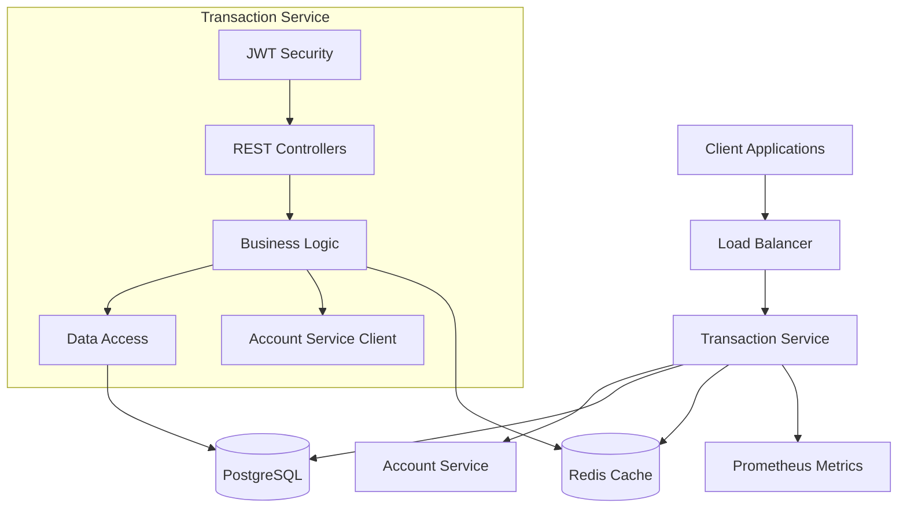
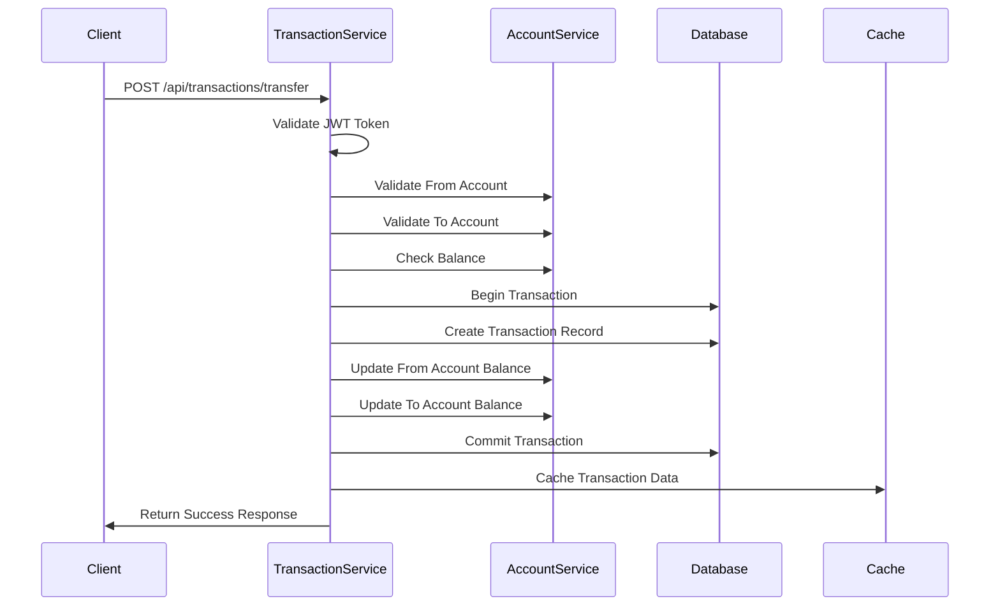

# Design Document

## Overview

The Transaction Service is designed as a microservice within the financial system architecture, responsible for processing all monetary transactions including transfers, deposits, withdrawals, and maintaining comprehensive transaction history. The service follows a layered architecture pattern with clear separation of concerns, integrates with the Account Service for account validation and balance management, and provides robust error handling, security, and monitoring capabilities.

The service is built using Spring Boot 3.5.3 with Java 22, leveraging PostgreSQL for persistent storage, Redis for caching, and RESTful APIs for communication. It implements JWT-based authentication, comprehensive audit logging, and transaction limit enforcement to ensure security and compliance.

**Current Implementation Status:**
- ✅ Core application structure and configuration complete
- ✅ All entities, DTOs, and repositories implemented
- ✅ Security configuration with JWT authentication in place
- ✅ Account Service integration client configured
- ✅ Basic transaction processing services implemented
- ✅ REST controllers and exception handling complete
- ⚠️ Testing suite needs completion (unit, integration, performance)
- ⚠️ Monitoring and observability features need enhancement
- ⚠️ API documentation needs to be added
- ⚠️ Advanced features like transaction reversal need implementation

## Architecture

### High-Level Architecture



### Service Integration Pattern



### Technology Stack

- **Framework**: Spring Boot 3.5.3 with Java 22
- **Database**: PostgreSQL 15+ for transaction persistence
- **Cache**: Redis 7+ for performance optimization
- **Security**: JWT tokens with Spring Security
- **Communication**: HTTP REST APIs with WebFlux for Account Service integration
- **Monitoring**: Micrometer with Prometheus metrics
- **Logging**: Structured JSON logging with Logstash encoder
- **Testing**: JUnit 5 with Testcontainers for integration tests

## Components and Interfaces

### Core Components

#### 1. Transaction Controller Layer
**Purpose**: Handle HTTP requests and responses for transaction operations

**Key Classes**:
- `TransactionController`: Main REST controller for transaction operations
- `TransactionQueryController`: Specialized controller for transaction queries and history

**Responsibilities**:
- Request validation and parameter binding
- HTTP response formatting
- Exception handling and error responses
- Authentication token extraction

#### 2. Transaction Service Layer
**Purpose**: Implement business logic for transaction processing

**Key Classes**:
- `TransactionService`: Core transaction processing logic
- `TransactionLimitService`: Transaction limit validation and enforcement
- `TransactionValidationService`: Input validation and business rule checks

**Responsibilities**:
- Transaction workflow orchestration
- Business rule enforcement
- Integration with Account Service
- Transaction limit validation
- Audit logging

#### 3. Data Access Layer
**Purpose**: Manage data persistence and retrieval

**Key Classes**:
- `TransactionRepository`: JPA repository for transaction entities
- `TransactionLimitRepository`: Repository for transaction limits configuration

**Responsibilities**:
- Database operations (CRUD)
- Query optimization
- Transaction management
- Data consistency

#### 4. Account Service Integration
**Purpose**: Communicate with Account Service for account operations

**Key Classes**:
- `AccountServiceClient`: HTTP client for Account Service communication
- `AccountServiceConfig`: Configuration for Account Service integration

**Responsibilities**:
- Account validation
- Balance inquiries and updates
- Error handling for service communication
- Retry mechanisms and circuit breaker patterns

#### 5. Security Layer
**Purpose**: Handle authentication and authorization

**Key Classes**:
- `JwtAuthenticationFilter`: JWT token validation
- `SecurityConfig`: Security configuration
- `JwtTokenProvider`: JWT token processing utilities

**Responsibilities**:
- JWT token validation
- User context extraction
- Role-based authorization
- Security headers management

### Data Models

#### Transaction Entity
```java
@Entity
@Table(name = "transactions")
public class Transaction {
    @Id
    private String transactionId;
    private String fromAccountId;
    private String toAccountId;
    private BigDecimal amount;
    private String currency;
    private TransactionType type;
    private TransactionStatus status;
    private String description;
    private LocalDateTime createdAt;
    private LocalDateTime processedAt;
    private String createdBy;
    private String reversalTransactionId;
}
```

#### Transaction Limit Entity
```java
@Entity
@Table(name = "transaction_limits")
public class TransactionLimit {
    @Id
    private Long id;
    private String accountType;
    private TransactionType transactionType;
    private BigDecimal dailyLimit;
    private BigDecimal monthlyLimit;
    private BigDecimal perTransactionLimit;
    private Integer dailyCount;
    private Integer monthlyCount;
    private Boolean active;
}
```

#### DTOs for API Communication
- `TransferRequestDTO`: Transfer operation request
- `DepositRequestDTO`: Deposit operation request
- `WithdrawalRequestDTO`: Withdrawal operation request
- `TransactionResponseDTO`: Transaction operation response
- `TransactionHistoryDTO`: Transaction history response
- `TransactionStatsDTO`: Transaction statistics response

### API Interfaces

#### Transaction Operations
```
POST /api/transactions/transfer
POST /api/transactions/deposit
POST /api/transactions/withdraw
POST /api/transactions/{id}/reverse
```

#### Transaction Queries
```
GET /api/transactions/{id}
GET /api/transactions/account/{accountId}
GET /api/transactions/user
GET /api/transactions/status/{status}
GET /api/transactions/account/{accountId}/stats
```

#### Health and Monitoring
```
GET /api/transactions/health
GET /actuator/health
GET /actuator/metrics
GET /actuator/prometheus
```

## Data Models

### Database Schema

#### Transactions Table
- **Primary Key**: `transaction_id` (UUID)
- **Foreign Keys**: `from_account_id`, `to_account_id` (references Account Service)
- **Indexes**: 
  - `idx_transactions_from_account` on `from_account_id`
  - `idx_transactions_to_account` on `to_account_id`
  - `idx_transactions_created_at` on `created_at`
  - `idx_transactions_status` on `status`
  - `idx_transactions_created_by` on `created_by`

#### Transaction Limits Table
- **Primary Key**: `id` (auto-increment)
- **Unique Constraint**: `account_type` + `transaction_type`
- **Purpose**: Store configurable transaction limits per account type

#### Enumerations
- **TransactionType**: TRANSFER, DEPOSIT, WITHDRAWAL, FEE, INTEREST, REVERSAL
- **TransactionStatus**: PENDING, PROCESSING, COMPLETED, FAILED, REVERSED, CANCELLED

### Caching Strategy

#### Redis Cache Usage
- **Transaction History**: Cache recent transaction history per user/account
- **Transaction Limits**: Cache active transaction limits for quick validation
- **Account Validation**: Cache account validation results with short TTL
- **Daily/Monthly Summaries**: Cache transaction summaries for limit checking

#### Cache Keys Pattern
```
transaction:history:{accountId}:{page}
transaction:limits:{accountType}:{transactionType}
transaction:summary:daily:{accountId}:{date}
transaction:summary:monthly:{accountId}:{month}:{year}
account:validation:{accountId}
```

## Error Handling

### Exception Hierarchy
```java
TransactionException (Base)
├── InsufficientFundsException
├── AccountNotFoundException
├── TransactionLimitExceededException
├── InvalidTransactionException
├── TransactionProcessingException
├── AccountServiceUnavailableException
└── DuplicateTransactionException
```

### Error Response Format
```json
{
  "timestamp": "2024-01-15T10:30:00Z",
  "status": 400,
  "error": "Bad Request",
  "message": "Insufficient funds for transaction",
  "path": "/api/transactions/transfer",
  "transactionId": "uuid-here",
  "errorCode": "INSUFFICIENT_FUNDS"
}
```

### Error Handling Strategy
1. **Validation Errors**: Return 400 Bad Request with detailed field errors
2. **Authentication Errors**: Return 401 Unauthorized
3. **Authorization Errors**: Return 403 Forbidden
4. **Resource Not Found**: Return 404 Not Found
5. **Business Logic Errors**: Return 422 Unprocessable Entity
6. **Service Unavailable**: Return 503 Service Unavailable with retry headers
7. **Internal Errors**: Return 500 Internal Server Error with correlation ID

### Retry and Circuit Breaker
- **Account Service Calls**: Implement exponential backoff retry (3 attempts)
- **Circuit Breaker**: Open circuit after 5 consecutive failures
- **Fallback Mechanisms**: Graceful degradation when Account Service is unavailable
- **Timeout Configuration**: 5-second timeout for Account Service calls

## Testing Strategy

### Unit Testing
- **Service Layer**: Mock dependencies and test business logic
- **Controller Layer**: Test request/response handling and validation
- **Repository Layer**: Test data access operations with @DataJpaTest
- **Security Layer**: Test JWT token validation and authorization

### Integration Testing
- **Database Integration**: Use Testcontainers for PostgreSQL testing
- **Redis Integration**: Test caching functionality with embedded Redis
- **Account Service Integration**: Mock Account Service responses
- **End-to-End API Testing**: Test complete transaction workflows

### Test Data Management
- **Test Fixtures**: Predefined test data for consistent testing
- **Database Cleanup**: Automatic cleanup between tests
- **Mock Configurations**: Separate test configurations for external services

### Performance Testing
- **Load Testing**: Test transaction processing under load
- **Stress Testing**: Test system behavior at breaking points
- **Database Performance**: Test query performance with large datasets
- **Cache Performance**: Validate cache hit rates and performance improvements

### Security Testing
- **Authentication Testing**: Test JWT token validation scenarios
- **Authorization Testing**: Test role-based access control
- **Input Validation**: Test SQL injection and XSS prevention
- **Rate Limiting**: Test API rate limiting functionality

### Test Coverage Requirements
- **Minimum Coverage**: 80% line coverage (configured in pom.xml with JaCoCo)
- **Critical Paths**: 95% coverage for transaction processing logic
- **Security Components**: 90% coverage for authentication/authorization
- **Integration Tests**: Cover all major API endpoints and workflows
- **Testcontainers**: Use PostgreSQL and Redis containers for integration testing

### API Documentation Strategy
- **OpenAPI/Swagger**: Comprehensive API documentation with examples
- **Authentication Guide**: Clear JWT token usage instructions
- **Integration Examples**: Sample requests and responses for all endpoints
- **Error Handling**: Documented error codes and troubleshooting guides

### Monitoring and Observability Implementation
- **Health Checks**: Custom health indicators for dependencies
- **Metrics Collection**: Business metrics for transaction processing
- **Structured Logging**: JSON logging with correlation IDs
- **Performance Monitoring**: Transaction latency and throughput metrics