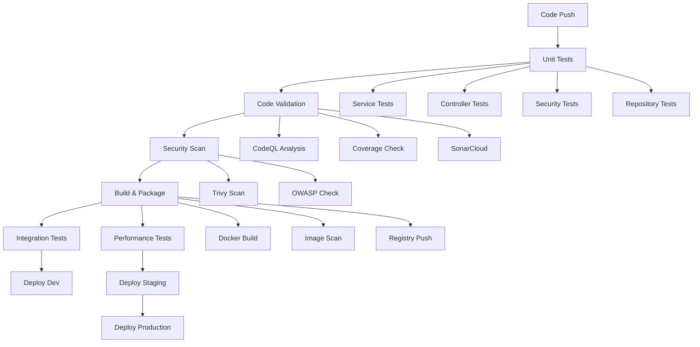

# CI/CD Pipeline Status

## Overview
The CI/CD pipeline has been streamlined to focus on core functionality (Tasks 1-7) while deferring advanced features (Tasks 8-12) to the final project stages.

## Current Active Pipeline Features ✅

### 1. Core Testing & Quality Gates
- **Unit Testing**: Parallel execution across test groups (service, controller, security, repository)
- **Code Coverage**: JaCoCo integration with configurable thresholds
- **Code Quality**: SonarCloud integration (optional)
- **Security Scanning**: CodeQL, Trivy filesystem, OWASP Dependency Check
- **Test Reporting**: Comprehensive test result publishing

### 2. Build & Container Management
- **Docker Build**: Multi-stage builds with caching
- **Container Registry**: GitHub Container Registry integration
- **Image Tagging**: Semantic versioning with branch-based tagging
- **Container Security**: Trivy image scanning
- **Metadata**: Comprehensive image labeling

### 3. Integration & Performance Testing
- **Integration Tests**: TestContainers with PostgreSQL
- **Performance Tests**: K6 load testing (main/develop branches only)
- **Database Testing**: Real database integration testing

### 4. Multi-Environment Deployment
- **Development**: Automatic deployment on develop branch
- **Staging**: Deployment on main branch with approval gates
- **Production**: Manual deployment on releases with health checks
- **Smoke Tests**: Post-deployment validation

### 5. Infrastructure & Monitoring
- **Kubernetes**: Deployment manifests and configurations
- **Health Checks**: Application health monitoring
- **Deployment Tracking**: Basic deployment markers
- **Environment Management**: Environment-specific configurations

## Deferred Features (Tasks 8-12) ⏸️

### 8. Notification and Communication System
- **Slack Integration**: Pipeline status notifications
- **Email Notifications**: Critical event alerts
- **Status**: Will implement when project reaches production scale

### 9. Backup and Disaster Recovery Automation
- **Database Backups**: Automated pre-deployment backups
- **Disaster Recovery**: Cross-region replication and recovery procedures
- **Status**: Will implement for production readiness

### 10. Security Compliance and Audit Trail
- **Advanced Security**: Comprehensive security policy enforcement
- **Audit Logging**: Detailed compliance reporting
- **Status**: Will implement for regulatory compliance needs

### 11. Pipeline Optimization and Performance
- **Advanced Caching**: Smart test selection and build optimization
- **Pipeline Analytics**: Performance metrics and optimization
- **Status**: Will implement for scale optimization

### 12. Documentation and Knowledge Transfer
- **Comprehensive Documentation**: Architecture guides and troubleshooting
- **Training Materials**: Developer onboarding and best practices
- **Status**: Will implement for team scaling

## Current Pipeline Workflow

## Benefits of Current Approach

### ✅ Immediate Value
- **Fast Feedback**: Quick identification of issues
- **Quality Assurance**: Comprehensive testing and security scanning
- **Automated Deployment**: Streamlined deployment process
- **Container Security**: Image vulnerability scanning
- **Multi-Environment**: Proper environment progression

### ✅ Maintainability
- **Simplified Workflow**: Easier to understand and maintain
- **Focused Features**: Core functionality without complexity
- **Incremental Enhancement**: Can add deferred features when needed

### ✅ Cost Efficiency
- **Free Tier Friendly**: Uses GitHub Actions free tier efficiently
- **Resource Optimization**: No unnecessary advanced features consuming resources
- **Scalable**: Can scale up when project grows

## Implementation Files

### Active Files
- `.github/workflows/ci-cd-pipeline.yml` - Core pipeline workflow
- `.kiro/specs/cicd-pipeline/tasks.md` - Updated task list with deferrals
- `account-service/Dockerfile` - Container build configuration
- `account-service/k8s/` - Kubernetes deployment manifests

### Backup Files
- `.github/workflows/ci-cd-pipeline-full.yml.backup` - Original comprehensive workflow
- Available for restoration when implementing deferred features

## Next Steps

### Immediate (Current Phase)
1. ✅ Test the core pipeline functionality
2. ✅ Validate all environments are working
3. ✅ Ensure security scanning is effective
4. ✅ Verify deployment process

### Future (Final Project Stages)
1. **Implement Notifications** (Task 8) - When team collaboration scales
2. **Add Backup/DR** (Task 9) - When moving to production
3. **Enhance Security** (Task 10) - For compliance requirements
4. **Optimize Performance** (Task 11) - For scale optimization
5. **Create Documentation** (Task 12) - For team onboarding

## Conclusion

The streamlined CI/CD pipeline provides all essential functionality for development, testing, and deployment while maintaining the flexibility to add advanced features when the project reaches production scale. This approach ensures immediate productivity while keeping future enhancement options open.